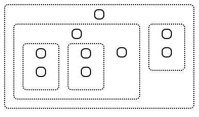

# Tree
Tree package for building Tree UI compoenent. It includes a fully customizable react component, stand-alone object builder and a custome HTML element. 
## Getting Started
`npm i @egeonu/tree`
## Usage
A few examples of useful commands and/or tasks.
## ReactTree
### Props (input configuration)
```ts
export type Config = {
    data: Array<any> // input is an example
    name?: string // Name of tree
    collapsible?: boolean // Can collapse
    tree_container_class?: string
    tree_children_class?: string
    tree_element_class?: string
    tree_leaf_class?: string
    tree_parent_class?: string
    onclick?: any // Onclick callback
}
```
```ts
import { ReactTree } from "@egeonu/tree";

    const input = [
        {
            id: 1,
        },
        {
            id: 2,
            parents: [1]
        },
        {
            id: 3,
            parents: [2, 1]
        },
        {
            id: 4,
            parents: [2]
        },
        {
            id: 5,
            parents: [2, 3, 4]
        }
    ]

root.render(
    <ReactTree data={input} />
);
```
### Expected output

## TreeBuilder
```ts
import { TreeBuilder } from "@egeonu/tree";

    const input = [
        {
            id: 1,
        },
        {
            id: 2,
            parents: [1]
        },
        {
            id: 3,
            parents: [2, 1]
        },
        {
            id: 4,
            parents: [2]
        },
        {
            id: 5,
            parents: [2, 3, 4]
        }
    ]
    // with props
    const tree = new TreeBuilder({ data: input });
    console.log(tree.data);
    // without props
    tree = new TreeBuilder();
    tree.createTree(input);
    console.log(tree.data);
    // static invoke
    tree = TreeBuilder.createTree(input);
    console.log(tree);
```
### Expected output 
```js
[
    {
      id: 1,
      children: [
        {
          id: 2,
          children: [
            {
              id: 3,
              children: [ { id: 5, children: [], data: undefined } ],
              data: undefined
            },
            {
              id: 4,
              children: [ { id: 5, children: [], data: undefined } ],
              data: undefined
            },
            { id: 5, children: [], data: undefined }
          ],
          data: undefined
        },
        {
          id: 3,
          children: [ { id: 5, children: [], data: undefined } ],
          data: undefined
        }
      ],
      data: undefined
    }
]
```
## TreeNodeElement
* You can use the TreeNodeElement to build your own tree with more control. 
* It will require some recursion, view example below. (This is from `ReactTree`)
```js
  function startMap (tree: Array<TreeNode>) {
    let self = this;
    const container = document.getElementById("tree_container");
    for (const object of tree) {
      // Create contanier for the node
      const element = document.createElement("div");
      element.setAttribute("id", object.id);
      // Create container to hold node data
      const leaf = document.createElement("tree-node") as TreeNodeElement;
      leaf.innerHTML = object.data?.content ? object.data?.content : "";
      element.appendChild(leaf);
      if (object.children.length > 0) {
        // Map children for this node
        self.mapTree(element, object.children, 2, leaf);
      }
      // Append to main container
      container.appendChild(element);
    }
  }

  mapTree (container: HTMLElement, tree: Array<TreeNode>, gap: number, parentLeaf: TreeNodeElement) {
    let self = this;
    // Create container for the children
    const children = document.createElement("div");
    const child_id = container.id + "-row";
    children.setAttribute("id", child_id);
    // Add children container id to the parent
    parentLeaf.setAttribute("rowId", child_id);
    for (const object of tree) {
      // Create contanier for the node
      const element = document.createElement("div");
      element.classList.add(this.config.tree_element_class);
      element.setAttribute("id", object.id + "-" + container.id);
      // Create container to hold node data
      const leaf = document.createElement("tree-node") as TreeNodeElement;
      element.appendChild(leaf);
      leaf.innerHTML = object.data?.content ? object.data?.content : "";
      if (object.children.length > 0) {
        element.classList.add(this.config.tree_parent_class);
        leaf.classList.add(this.config.tree_leaf_class);
        // Map children for this node
        self.mapTree(element, object.children, gap, leaf);
      }
      // Append to children container
      children.appendChild(element);
    }
    // Append to main container
    container.appendChild(children);
  }
```
* In this example we set the attribute `rowId` with the id of the element we expect to hold the children of the current node.
* I choose to build `child_id` from a concatenation of all the parent ids' with the child to avoid collisions.
* This allows for the built in event listener to handle closing and opening the element holding the children.
## To-Do
1. Style options: flat, tree, horizontal and vertical
2. Draw connector lines with SVG